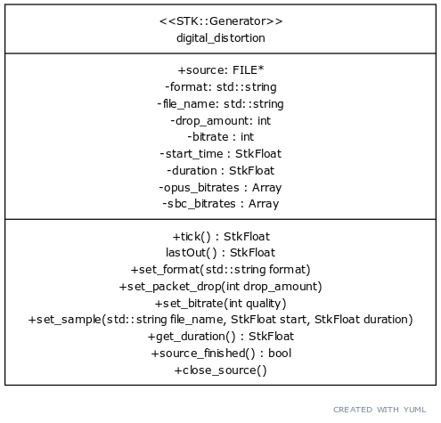

# Recreating Common Digital Distortion Effects

## Overview

For my final project this semester in MUMT 307, I decided to create a distortion effect program. The program is implemented as a generator within the STK platform, providing a tick level interface for producing distorted audio from a provided sample source. 

## Objectives

My goal with this project was to recreate, as accurately as possible, a variety of common ways I have experienced distorted digital audio in my day to day life. Specifically I wanted to recreate the effects of Bluetooth headphones far from their source, and voice call and audio streaming with poor connection. Particularly, I wanted to create a way to apply these effects with easily parameterized amounts of distortion to arbitrary audio sources. 

## Implementation

I implemented the plugin as a C++ program, compiled for Linux. In its simplest form, the program can be run on its own from the command line, with a file name and a variety of parameters provided, and will play back the audio file distorted according to the parameters provided. The program implements two different modes of distortion, corresponding to two different audio codecs, SBC and OPUS. 

The parameters supplied to the program(aside from a sample and a time selection for how much of it to play) include the format, a rate at which to drop packets(which can just be 0) and a bitrate quality selector. The selector for bitrates is designed on a scale from 0-10, with values chosen to provided roughly similar levels of quality for each format. 

|Selector Value | SBC Bitrate | OPUS Bitrate|
|---------------|-------------|-------------|
| 0 | 50000 | 500
| 1 | 60000 | 1000
| 2 | 70000 |2000
| 3 | 80000 |3000
| 4 | 90000 |4000
| 5 | 100000|5000
| 6 | 110000|6000
| 7 | 120000|7000
| 8 | 130000|8000
| 9 | 140000|9000
| 10 | 150000 | 10000

With the parameters and audio source having been set, the program concatenatively constructs a system call to FFMPEG and opens a pipe to it, such that the audio source provided will be filtered through the specified codecs and floating point samples output to the pipe. The program then can read a sample from the pipe each time a tick call comes through its STK interface, and provide it to whatever further use it will go to.

A UML diagram of the interface of the generator is provided below:



### STK Interface

The program implements the STK generator interface, allowing other programs to use ```tick()``` on it like any other generator. Other aspects of the generator however must be set using the specific interface methods provided by the program, such as modifying the source or control parameters. 

### Interfacing With Codecs

The program uses the FFMPEG tool as a middleman between it and the implementations of the audio codecs themselves. FFMPEG provides us with a unified way to specify the parameters with which to encode the audio as well as a straightforward way to supply audio files to the codecs and extra single sample outputs. We make use of pipes, a standard Linux interprocess communication tool. The pipes allow us to, first of all, feed multiple FFMPEG calls through each other(for the purpose of encoding and then decoding to produce distortion), and then subsequently convert the floating point samples that FFMPEG outputs from raw binary to something easy to parse in C++ using od, a standard Unix tool. Finally we have a pipe within the program itself that reads the ultimate output from the chained system calls. 

## Results

My program effectively recreates the distortion effects I attempted to replicate. I'll compare an example of its output to an actual example of my headphones distorting a signal. As well, I include some further examples of its effect on audio of various types.

### Comparison
[This is the raw sample I used:](/demo_raw.wav)

[This is the sample as it plays through my headphones in normal conditions:](/demo_distorted.wav)

[This is the sample as it plays through my headphones, distanced from my computer and through a thick glass door:](/demo_headphones.wav)

[This is the sample after being fed through my program:](/demo_recreated.wav)

### More Examples

[Here is an example of speech distorted with low bitrate OPUS:](/speech_distorted.wav)

[Here is an example of heavily distorted pop music with the SBC protocol:](/umbrella_distorted.wav)

[Here is an example of classical music distorted with low bitrate and packet dropping:](/classical_distorted.wav)


## Issues And Solutions

The most challenging parts of this project were in the software engineering and planning phase. First of all, I had to do a fair amount of research to figure out which codecs I was even noticing distortion coming from, then figuring out a way to interface with them effectively. A major problem I encountered was that many of these codecs do not provide a standardized interface to interact with them programatically, and the documentation surrounding them is often sparse. As well, for the interfaces and libraries that are provided a large amount of boilerplate code would be required to get all the data in the correct formats for use with the codecs. I ultimately resolved this by making use of FFMPEG as an inbetween layer between my program and the codecs themselves.

A further problem was that codecs are generally designed to sound good. This is of course in direct opposition to my objectives, and led to a lot of difficulty in finding effective parameters for achieving the kinds of distortion I was looking forward. 

### Potential Improvements

A number of improvements to this program are possible, including toward both functionality and ease of use. Some examples are:

- A GUI interface like other STK generators
- A MIDI interface for setting parameters
- Replace FFMEPG calls with more powerful LibAvCodec/LibAvFilter interface
- Stereo/Multiple channel support
- Compiling for Windows and Mac
- Compiling for use as a VST or other plugin type
- Real time audio input as well as output

### Alternative Approaches

There are other approaches to my objectives that would have also been viable. For example, I could have, instead of using the original codecs to reproduce the distortion effects, instead attempted to approximate them with standard audio effects. For example, with a precisely tweaked combination of low pass filters, bitcrushing and noise I almost certainly could have created an effect virtually indistinguishable from the actual one. 

Alternatively, I could have attempted something like attempted to fully recreate the algorithms used within the codecs to a lower degree of precision, cutting out all the functionality except that which affects the audio in ways I want. This would have been quite a large undertaking and required indepth research to understand industrial strength encoding algorithms.

One final possibility would have been leveraging the fact that to have the distortion effects in the first place, my computer must implement them, and so it would have been possible to have the computer produce the desired effects without additional special code, but it would have required the elaborate use of constructing and modifying virtual audio devices and passing signals between them.
